<!--
  ADNAN YAR · FROM SIGNAL TO SYSTEM
  GitHub profile README for github.com/adnanyar/adnanyar.
  Needs the /assets folder next to this file. Section panels and buttons are generated by
  scripts/build_panels.py (edit facts there, then run it); hero, landscape and w001–w003 are hand-drawn.
  Palette and notation follow DevDevise: cyan = systems, violet = research, blue = links, amber = signal;
  solid = built, dashed = proposed. Lines marked VERIFY need the author's confirmation before publishing.
-->

<a name="top"></a>

<p align="center">
  
</p>

<p align="center">
  <sub><b>Adnan Yar</b> · software engineer · founder &amp; CEO, DevDevise · AI systems · automation · SaaS · product engineering</sub><br />
  <sub>■ built &nbsp;·&nbsp; ◧ experimental &nbsp;·&nbsp; ⬚ proposed &nbsp;—&nbsp; every entry on this page carries a mark, and every number cites its source.</sub>
</p>

<p align="center">
  <a href="#architecture"></a>
  <a href="#systems"></a>
  <a href="#shipped"></a>
</p>

<br />

<a name="signal"></a>

<p align="center">
  
</p>

<details>
<summary><sub>read the signal as text</sub></summary>
<br />

I'm a software engineer and founder. I build intelligent software systems, and I solve hard technical problems through structured engineering and research.

I founded **DevDevise** around one idea: strong systems should be *devised* through investigation and evidence before they are engineered. DevDevise is a **SysMalla** company. SysMalla works on the business, and DevDevise works on the system.

Alongside that, I've shipped CRMs, ERP modules, order management, calendar sync and AI matchmaking at software companies delivering across Pakistan and the GCC.

</details>

<br />

<a name="landscape"></a>

<p align="center">
  
</p>

<details>
<summary><b>margin note A</b> · reading the landscape</summary>
<br />

- **Foundations** are the parts that have to keep running: throughput, latency, degraded modes, recovery. Architecture decides what the parts are, what each one is responsible for, and what happens when one fails.
- **Materials** are what intelligence is made from: models, data and automation. Automation here means taking repeated human work out of a process *without* taking human judgement out of it.
- **Delivered** is what people touch: software that makes decisions under uncertainty and knows when to hand a decision back to a person, wrapped in a product that shows its reasoning instead of hiding it.

The map is a model of how the work fits together. It isn't a claim that every arrow has carried production traffic.

</details>

<br />

<a name="systems"></a>

<p align="center">
  
</p>

<p align="center">
  
</p>

<p align="center">
  
</p>

<p align="center">
  
</p>

<br />

<a name="shipped"></a>

<!-- VERIFY: the 60% (ChattersHub) figure comes from the previous README, not the resume. Keep it only if you can back it up; edit SHIPPED in scripts/build_panels.py. -->
<p align="center">
  
</p>

<details>
<summary><b>margin note B</b> · the full register</summary>
<br />

<!-- VERIFY: MediNursing AI comes from the previous README only. Confirm its scope (prototype or deployed) and stack. -->
| | System | What it is | Stack |
| :-: | :-- | :-- | :-- |
| ■ | ChattersHub CRM | lead-pipeline CRM | Next.js, Node.js, TypeScript, MongoDB, AWS |
| ■ | Comtanix syndication + OMS | posting automation, order management, e-commerce platform | — |
| ■ | 5D Solutions ERP | 3+ ERP modules for a UAE-based ERP and SaaS company | — |
| ■ | Pindot Calendar Sync | Google Calendar ↔ CalDAV sync | Laravel, MySQL |
| ■ | Lease Match NYC | AI apartment matchmaking | Express, React, MongoDB, OpenAI |
| ■ | MediNursing AI | AI medical triage assistant | Python, FastAPI |
| ■ | Meraki LMS | learning management for institutions | Node.js, RabbitMQ, microservices, MySQL |
| ■ | Meraki Examerz | nursing exam management | Next.js, MongoDB, push notifications |
| ■ | Styzeler | hiring portal for hair & beauty spas | Laravel, Blade, MySQL |
| ■ | KFUEIT LMS | finance modules of a university LMS | PHP MVC |
| ■ | Task4Task · CivicPulse | products in development | see [03](#systems) |
| ◧ | Agrimonitor | remote-sensing R&D | concept |

</details>

<br />

<a name="architecture"></a>

<p align="center">
  
</p>

<details>
<summary><b>margin note C</b> · principles</summary>
<br />

**01 · Measure where the time goes first.** Before building anything, trace the problem end to end. It usually changes the goal.

**02 · Know when not to answer.** Systems that hand uncertain cases to people are the ones people keep trusting.

**03 · Keep the evidence, and the dead ends.** Every finding links to its experiments. Rejected ideas stay on the record.

</details>

<br />

<a name="lab"></a>

<!-- VERIFY: the three bench prototypes were found on your machine. Confirm they're yours and fine to mention; link them once public. -->
<p align="center">
  
</p>

<details>
<summary><b>margin note D</b> · how a problem is devised into a system</summary>
<br />

```text
01 PROBLEM    the problem, exactly as stated
02 DECOMPOSE  phrases lift out; each becomes a part
              of the system, or a limit on it
03 INVENT     candidate mechanisms, drawn dashed;
              rejected ones are marked ⊘ and stay
04 ENGINEER   the chosen design snaps to the grid
              and turns solid; limits become sizes
05 RUN        a sample input travels through it,
              and the readings appear
```

That's what the hero at the top of this page does, using Task4Task's architecture.

</details>

<br />

<a name="vector"></a>

<!-- VERIFY: "learning" is inferred from Agrimonitor's research needs. Replace it with what you're actually studying (NOW in scripts/build_panels.py). -->
<p align="center">
  
</p>

<br />

<a name="record"></a>

<!-- VERIFY: dates and titles follow the resume (Software Developer, 02/2023). The previous README said "Senior Software Developer, October 2022". Use whichever is current and correct (RECORD in scripts/build_panels.py). -->
<p align="center">
  
</p>

<details>
<summary><b>margin note E</b> · claims ledger</summary>
<br />

Every number on this page, and where it comes from.

| Claim | Source |
| :-- | :-- |
| Gold medal, highest academic performance in the batch | university record (resume) |
| 3+ ERP modules · +20% internal process automation | 5D Solutions role (resume) |
| 90% of posting workflows automated · +30% engagement | Comtanix role (resume) |
| +60% team productivity from the OMS | Comtanix role (resume) |
| +20% reporting accuracy, LMS finance modules | KFUEIT internship (resume) |
| 60% reduction in manual lead-handling time | ChattersHub delivery |
| Task4Task, CivicPulse: active, in development | DevDevise project records. No usage figures published. |
| Agrimonitor: R&D, no results | DevDevise project records |

</details>

<details>
<summary><b>margin note F</b> · telemetry</summary>
<br />

<p align="center">
  
</p>

</details>

<br />

<a name="channel"></a>

<p align="center">
  
</p>

<!-- VERIFY: devdevise.com isn't deployed yet (its host currently serves an empty page). Remove that button until it is. -->
<p align="center">
  <a href="mailto:adnanyar143@gmail.com"></a>
  <a href="https://linkedin.com/in/adnanyar"></a>
</p>
<p align="center">
  <a href="https://www.adnanyar.com"></a>
  <a href="https://devdevise.com"></a>
</p>

<br />

<p align="center">
  
</p>

<p align="center"><sub><a href="#top">↑ back to the signal</a></sub></p>
