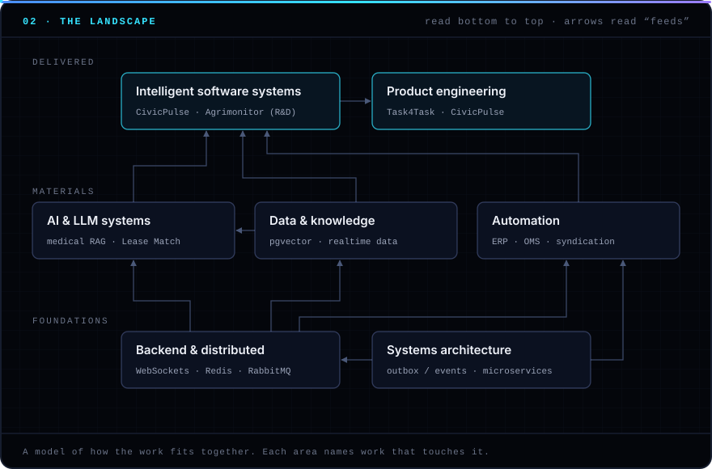
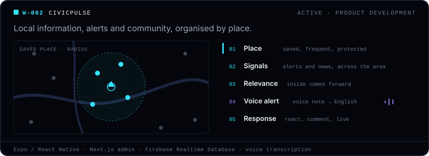
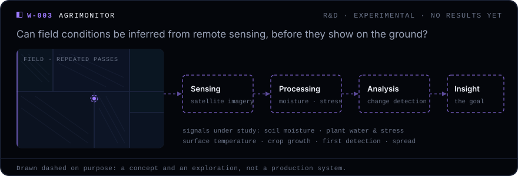

<!--
  ADNAN YAR · FROM SIGNAL TO SYSTEM
  GitHub profile README for github.com/adnanyar/adnanyar.
  Needs the /assets folder next to this file (hero, landscape, w001–w003, eof SVGs).
  Palette and notation follow DevDevise: cyan = systems, violet = research, blue = links, amber = signal;
  solid = built, dashed = proposed. Lines marked VERIFY need the author's confirmation before publishing.
-->

<a name="top"></a>

<p align="center">
  
</p>

<p align="center">
  <sub><b>Adnan Yar</b> · software engineer · founder &amp; CEO, DevDevise · AI systems · automation · SaaS · product engineering</sub>
</p>

<p align="center">
  <sub>■ built &nbsp;·&nbsp; ◧ experimental &nbsp;·&nbsp; ⬚ proposed &nbsp;—&nbsp; every entry on this page carries a mark, and every number cites its source.</sub>
</p>

<br />

<table align="center">
  <tr>
    <td align="center"><sub>ENTER AS</sub></td>
    <td><b>an engineer</b><br /><sub><a href="#architecture">architecture</a> → <a href="#lab">lab</a> → <a href="#shipped">register</a></sub></td>
    <td><b>a founder or partner</b><br /><sub><a href="#systems">systems</a> → <a href="#vector">vector</a> → <a href="#channel">channel</a></sub></td>
    <td><b>hiring</b><br /><sub><a href="#shipped">shipped</a> → <a href="#record">record</a> → <a href="#channel">channel</a></sub></td>
  </tr>
</table>

<br />

<a name="signal"></a>

## 01 · Signal

<p align="center">
  
</p>

<details>
<summary><sub>read the signal as text</sub></summary>
<br />

I'm a software engineer and founder. I build intelligent software systems, and I solve hard technical problems through structured engineering and research.

I founded **DevDevise** around one idea: strong systems should be *devised* through investigation and evidence before they are engineered. DevDevise is a **SysMalla** company. SysMalla works on the business, and DevDevise works on the system.

Alongside that, I've shipped CRMs, ERP modules, order management, calendar sync and AI matchmaking at software companies delivering across Pakistan and the GCC.

- **Role:** founder & CEO · DevDevise, SysMalla
- **Practice:** software engineer · full-stack · systems architect
- **Focus:** intelligent systems · AI / LLM · automation · SaaS
- **Record:** ◆ gold medal, BS Software Engineering, KFUEIT

</details>

<br />

<a name="landscape"></a>

## 02 · The landscape

Read it from the bottom up. Foundations feed materials, materials feed what gets delivered, and every area names real work that touches it.

<p align="center">
  
</p>

<details>
<summary><b>margin note A</b> · reading the landscape</summary>
<br />

- **Foundations** are the parts that have to keep running: throughput, latency, degraded modes, recovery. Architecture decides what the parts are, what each one is responsible for, and what happens when one fails.
- **Materials** are what intelligence is made from: models, data and automation. Automation here means taking repeated human work out of a process *without* taking human judgement out of it.
- **Delivered** is what people touch: software that makes decisions under uncertainty and knows when to hand a decision back to a person, wrapped in a product that shows its reasoning instead of hiding it.

The map is a model of how the work fits together. It isn't a claim that every arrow has carried production traffic.

</details>

<br />

<a name="systems"></a>

## 03 · Systems in development

These products are built through DevDevise. They're real and active. No user, revenue or accuracy figures are published yet, so none are claimed here.

<p align="center">
  
</p>

■ **Task4Task** is a two-sided marketplace (Hiring, and Getting Work) where a task is either paid or traded for work through barter and credits. In-person tasks get live location, worker travel tracking and coordination on a map. State changes go through an outbox, so the rest of the system hears about them reliably.

<br />

<p align="center">
  
</p>

■ **CivicPulse** is AI community intelligence. Information is abundant, but local relevance is hard. CivicPulse decides what matters to a person from where they are and the places they care about. An alert can start as a voice note, transcribed to English, and the community's responses arrive in real time.

<br />

<p align="center">
  
</p>

◧ **Agrimonitor** is R&D, not a product. It asks whether satellite imagery and environmental signals can show crop stress, moisture, temperature and change before they're visible from the ground. It's drawn dashed because none of it is presented as built.

<br />

<a name="shipped"></a>

## 04 · Shipped

Systems delivered as an engineer, before and alongside DevDevise. Each case file reads *problem → system → stack → outcome*. Where no result was measured, the file says **aim** instead of **outcome**.

<!-- VERIFY: the 60% figure is carried over from the previous README and is not on the resume. Keep it only if you can back it up. -->
```text
■ SHIP-01  CHATTERSHUB CRM
problem  lead handling depended on manual effort
system   CRM built around automating the lead pipeline
stack    Next.js · React · Tailwind
         Node.js · TypeScript · Express · MongoDB
         AWS S3 · Docker
outcome  60% reduction in manual lead-handling time
```

```text
■ SHIP-02  SYNDICATION + ORDER MANAGEMENT · COMTANIX
problem  posting to every channel by hand; slow order handling
system   social-media syndication tool, and an OMS
outcome  90% of posting workflows automated
         +30% digital engagement
         +60% team productivity (OMS)
```

```text
■ SHIP-03  PINDOT CALENDAR SYNC
problem  Google and CalDAV calendars drift apart
system   synchronization between Google Calendar and
         a CalDAV server (Baïkal)
stack    Laravel · MySQL · Google Calendar API · CalDAV
aim      one calendar, whichever client edits it
```

```text
■ SHIP-04  LEASE MATCH NYC
problem  matching renters to apartments by hand
system   AI-powered apartment matchmaking platform
stack    Express · React · Tailwind · MongoDB
         OpenAI · geolocation
aim      match renters to apartments by fit and place
```

<details>
<summary><b>margin note B</b> · the full register</summary>
<br />

<!-- VERIFY: MediNursing AI comes from the previous README only. Confirm its scope (prototype or deployed) and stack. -->
| | System | What it is | Stack |
| :-: | :-- | :-- | :-- |
| ■ | ChattersHub CRM | lead-pipeline CRM | Next.js, Node.js, TypeScript, MongoDB, AWS |
| ■ | Comtanix syndication + OMS | posting automation, order management, e-commerce platform | — |
| ■ | 5D Solutions ERP | 3+ ERP modules for a UAE-based ERP and SaaS company | — |
| ■ | Pindot Calendar Sync | Google Calendar ↔ CalDAV sync | Laravel, MySQL |
| ■ | Lease Match NYC | AI apartment matchmaking | Express, React, MongoDB, OpenAI |
| ■ | MediNursing AI | AI medical triage assistant | Python, FastAPI |
| ■ | Meraki LMS | learning management for institutions | Node.js, RabbitMQ, microservices, MySQL |
| ■ | Meraki Examerz | nursing exam management | Next.js, MongoDB, push notifications |
| ■ | Styzeler | hiring portal for hair & beauty spas | Laravel, Blade, MySQL |
| ■ | KFUEIT LMS | finance modules of a university LMS | PHP MVC |
| ■ | Task4Task · CivicPulse | products in development | see [03](#systems) |
| ◧ | Agrimonitor | remote-sensing R&D | concept |

</details>

<br />

<a name="architecture"></a>

## 05 · Architecture

The stack I reach for, drawn as layers instead of logos:

```text
 ┌─ INTERFACE ─────────────────────────────────────┐
 │  React · Next.js · Vue · Tailwind CSS           │
 │  Expo / React Native                            │
 └────────────────────────┬────────────────────────┘
                          │  REST · WebSockets · WebRTC
 ┌─ APPLICATION ──────────┴────────────────────────┐
 │  Node.js · TypeScript · Express                 │
 │  Laravel · PHP · Python · FastAPI               │
 │  RabbitMQ · outbox / events · microservices     │
 └───────────┬─────────────────────────────────┬───┘
             │                                 │
 ┌─ DATA ────┴───────────┐ ┌─ INTELLIGENCE ────┴───┐
 │  PostgreSQL · MySQL   │ │  OpenAI · LLM flows   │
 │  MongoDB · Redis      ├─┤  RAG · pgvector       │
 │  Firebase RTDB        │ │  Whisper (speech)     │
 └───────────────────────┘ └───────────────────────┘
 ══════════════════ INFRASTRUCTURE ═════════════════
     AWS · Docker · CI/CD · Caddy · Git
```

<details>
<summary><b>margin note C</b> · principles</summary>
<br />

**01 · Measure where the time goes first.** Before building anything, trace the problem end to end. It usually changes the goal.

**02 · Know when not to answer.** Systems that hand uncertain cases to people are the ones people keep trusting.

**03 · Keep the evidence, and the dead ends.** Every finding links to its experiments. Rejected ideas stay on the record.

</details>

<br />

<a name="lab"></a>

## 06 · Lab

Questions get the same treatment as systems: each one is stated before it's tested, and labelled honestly.

◧ `R-001` &nbsp;**Can a website demonstrate engineering reasoning instead of describing it?**<br />
<sub>&emsp;&emsp;&emsp;&emsp;&emsp;The DevDevise site is the experiment. Accessibility audits, responsive checks and sequence timing were run on its own build.</sub>

⬚ `EX-01` &nbsp;Can a retrieval system reliably tell when it doesn't have the answer?<br />
⬚ `EX-02` &nbsp;How long can a tool-using agent work before its errors compound past usefulness?<br />
⬚ `EX-03` &nbsp;Can we tell that a model's input data has drifted before its accuracy drops?<br />
<sub>&emsp;&emsp;&emsp;&emsp;&emsp;Structured as they would be run, with planned experiments. Not run yet, so no results.</sub>

<!-- VERIFY: these three repos were found on your machine. Confirm they're yours and fine to mention; link them once public. -->
**On the bench** ◧

| Prototype | What it tests | Built with |
| :-- | :-- | :-- |
| MedQuery | a multi-tenant medical RAG API: ingestion, chunking, embeddings, retrieval and chat per workspace | FastAPI · PostgreSQL + pgvector · JWT |
| Medical RAG assistant | documents, images and speech feeding one retrieval pipeline | Python · vector store · LLM client |
| Audio Intelligence Parser | local speech-to-text, then strict structured extraction | FastAPI · Whisper · OpenAI · Next.js |

<details>
<summary><b>margin note D</b> · how a problem is devised into a system</summary>
<br />

```text
01 PROBLEM    the problem, exactly as stated
02 DECOMPOSE  phrases lift out; each becomes a part
              of the system, or a limit on it
03 INVENT     candidate mechanisms, drawn dashed;
              rejected ones are marked ⊘ and stay
04 ENGINEER   the chosen design snaps to the grid
              and turns solid; limits become sizes
05 RUN        a sample input travels through it,
              and the readings appear
```

That's what the hero at the top of this page does, using Task4Task's architecture.

</details>

<br />

<a name="vector"></a>

## 07 · Vector

```text
engineer → architect → researcher → builder → founder
                                                ▲
                                               now
```

<!-- VERIFY: "learning" is inferred from Agrimonitor's research needs. Replace it with what you're actually studying. -->
```text
building     Task4Task, CivicPulse · through DevDevise
researching  Agrimonitor: field conditions from orbit
learning     remote sensing: moisture, stress, change
asking       when should a retrieval system say "I don't know"?
direction    from client systems to systems of our own
```

<br />

<a name="record"></a>

## 08 · Record

<!-- VERIFY: dates and titles follow the resume (Software Developer, 02/2023). The previous README said "Senior Software Developer, October 2022". Use whichever is current and correct. -->
| When | Where | What |
| :-- | :-- | :-- |
| now | **Founder &amp; CEO** · DevDevise, SysMalla | R&D-driven software engineering: Task4Task, CivicPulse, Agrimonitor |
| 2023 → now | **Software Developer** · 5D Solutions LLC | UAE-based ERP and SaaS across the GCC and Pakistan. 3+ ERP modules, +20% internal process automation. |
| 2023 → 2025 | **Web Developer** · Comtanix | Syndication tool (90% of posting automated), OMS (+60% team productivity), e-commerce platform |
| 2022 | **Interns** · Pixako Technologies, KFUEIT Data Center | Scrum sprints and deployment scripts; finance modules for the university LMS |
| 2019 → 2023 | **BS Software Engineering** · KFUEIT | ◆ Gold medal for the highest academic performance in the batch |

<sub>Certificates: AWS Practitioner (Coursera) · Certified in Cyber Security (NAVTTC)</sub>

<details>
<summary><b>margin note E</b> · claims ledger</summary>
<br />

Every number on this page, and where it comes from.

| Claim | Source |
| :-- | :-- |
| Gold medal, highest academic performance in the batch | university record (resume) |
| 3+ ERP modules · +20% internal process automation | 5D Solutions role (resume) |
| 90% of posting workflows automated · +30% engagement | Comtanix role (resume) |
| +60% team productivity from the OMS | Comtanix role (resume) |
| +20% reporting accuracy, LMS finance modules | KFUEIT internship (resume) |
| 60% reduction in manual lead-handling time | ChattersHub delivery |
| Task4Task, CivicPulse: active, in development | DevDevise project records. No usage figures published. |
| Agrimonitor: R&D, no results | DevDevise project records |

</details>

<details>
<summary><b>margin note F</b> · telemetry</summary>
<br />

<p align="center">
  
</p>

</details>

<br />

<a name="channel"></a>

## 09 · Channel

```text
$ open channel --to adnan.yar
  connected · reply latency: human
```

<!-- VERIFY: devdevise.com isn't deployed yet (its host currently serves an empty page). Remove the company row until it is. -->
| | |
| :-- | :-- |
| mail | [adnanyar143@gmail.com](mailto:adnanyar143@gmail.com) |
| linkedin | [linkedin.com/in/adnanyar](https://linkedin.com/in/adnanyar) |
| web | [adnanyar.com](https://www.adnanyar.com) |
| company | [devdevise.com](https://devdevise.com) · [hello@devdevise.com](mailto:hello@devdevise.com) |
| github | you're already here |

Open to conversations about **intelligent systems, AI and LLM engineering, automation, SaaS architecture and product R&D**.

<br />

<p align="center">
  
</p>

<p align="center"><sub><a href="#top">↑ back to the signal</a></sub></p>
