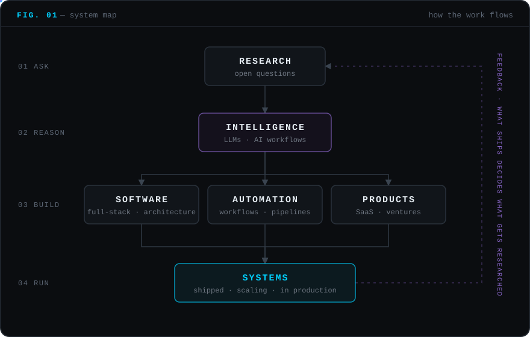

<!--
  ADNAN YAR — SYSTEMS NOTEBOOK
  GitHub profile README. Requires the /assets folder (boot.svg, system-map.svg, eof.svg)
  to sit next to this file in the adnanyar/adnanyar profile repository.
  Lines marked VERIFY are claims carried over from the previous README: confirm before publishing.
-->

<p align="center">
  
</p>

<p align="center">
  <sub>the working notebook of <b>Adnan Yar</b>: software engineer, full-stack systems architect, builder of AI-enabled products</sub>
</p>

<br />

## 01 — Signal

I build software that takes manual work out of how organisations run: CRMs, ERP modules, order management, real-time sync. More and more, I also build the AI layer that sits inside those systems.

The work moves through four stages. First I write the code, then I design the system around it. Next I ask whether it should exist at all, and finally I turn the answer into a product. The last stage is where **Sysmalla** and **DevDevise** come in.

<!-- VERIFY: AWS certification. Official name is "AWS Certified Cloud Practitioner". Remove the line if not currently held. -->
```text
role      software engineer · full-stack · systems architect
focus     AI / LLM integration · automation · SaaS · R&D
record    gold medalist, software engineering
          AWS Certified Cloud Practitioner
building  sysmalla → devdevise → products
```

<br />

## 02 — The system map

Every project I take on passes through this loop. The arrows matter more than the boxes.

<p align="center">
  
</p>

<details>
<summary><b>margin note A</b> · reading the map</summary>
<br />

1. **Research** starts with a question, not a feature request. *Why is this still done by hand?*
2. **Intelligence** decides where an LLM or an AI workflow actually helps, and where plain deterministic code is the better answer.
3. **Build** splits three ways: *software* (the application and its architecture), *automation* (the work it removes) and *products* (the parts worth turning into something others can use).
4. **Systems** are the output: deployed and used.
5. The **feedback loop** is the point. Whatever a running system teaches goes back into research.

</details>

### What I build

| System class | What that means in practice | On record |
| :-- | :-- | :-- |
| **AI systems** | LLM workflows embedded in real applications | MediNursing AI, Lease Match NYC |
| **Real-time systems** | state that stays consistent across users, live | Pindot Sync |
| **SaaS & ERP platforms** | multi-module business platforms built to scale | 5D Solutions |
| **Automation** | pipelines that replace repetitive operational work | ChattersHub, Comtanix OMS |
| **Data & intelligence** | relational, document and cache layers that feed decisions | across all of the above |
| **Product engineering** | taking an idea from first sketch to a shipped product | DevDevise |
| **Cloud infrastructure** | AWS, containers, delivery pipelines | across all of the above |

<br />

## 03 — Architecture

My default stack, drawn as layers rather than a list of logos:

```text
 ┌─ INTERFACE ─────────────────────────────────────┐
 │  React · Next.js · Vue · Tailwind CSS           │
 └────────────────────────┬────────────────────────┘
                          │  HTTP · WebSocket
 ┌─ APPLICATION ──────────┴────────────────────────┐
 │  Laravel · PHP · Node.js · Python · FastAPI     │
 └───────────┬─────────────────────────────────┬───┘
             │                                 │
 ┌─ DATA ────┴───────────┐ ┌─ INTELLIGENCE ────┴───┐
 │  PostgreSQL · MySQL   │ │  LLMs · AI workflows  │
 │  MongoDB · Redis      ├─┤  RAG · embeddings     │
 └───────────────────────┘ └───────────────────────┘
 ══════════════════ INFRASTRUCTURE ═════════════════
     AWS · Docker · CI/CD · Git
```

<details>
<summary><b>margin note B</b> · engineering principles</summary>
<br />

- **Automate the boring part first.** It's usually where the errors live.
- **Put an LLM only where its output is cheap to verify.** Everywhere else, write the rule.
- **Real-time is a promise.** Design for the moment the network breaks it.
- **Boring infrastructure, interesting products.** Novelty belongs in what users touch.
- **Measure before and after.** If it wasn't measured, it didn't improve.

</details>

<br />

## 04 — Shipped

Selected systems, each written up as a short case file.

<!-- VERIFY: "60% reduction in manual lead handling time" is carried over from the previous README. Keep it only if you can back it up. -->
```text
SHIP-01  CHATTERSHUB CRM
problem  lead handling depended on manual effort
system   CRM built around automating the lead pipeline
stack    Next.js · Node.js
outcome  60% reduction in manual lead-handling time
```

<!-- VERIFY: prototype or deployed? Medical triage claims draw scrutiny; describe the actual scope. -->
```text
SHIP-02  MEDINURSING AI
problem  triage needs a fast, consistent first response
system   AI-powered medical triage assistant
stack    Python · FastAPI
aim      faster first response in triage
```

```text
SHIP-03  PINDOT SYNC
problem  calendars drift apart when edits happen everywhere
system   real-time, global calendar synchronization
stack    Laravel · WebSocket
aim      one calendar state, live, for every user
```

<!-- VERIFY: confirm the matchmaking actually uses AI/ML and not rule-based matching. -->
```text
SHIP-04  LEASE MATCH NYC
problem  matching renters to listings doesn't scale by hand
system   AI-assisted matchmaking for NYC real estate
stack    Laravel · Vue.js
aim      scale matching without scaling manual work
```

<br />

## 05 — Active systems

What's running right now, beyond client work:

<!-- TODO: add a one-line description for task4task and civicpulse, and link each to a repo or site when public. -->
```text
$ status --all

● sysmalla     umbrella · company ecosystem      ACTIVE
● devdevise    build arm · products, R&D         ACTIVE
● task4task    product                           IN DEV
● civicpulse   product                           IN DEV
```

<br />

## 06 — Lab

Some of my work is open questions rather than tickets. These are the ones my projects keep raising:

`Q-01` &nbsp;Where does an LLM belong inside a business workflow, and where should it be kept out?<br />
`Q-02` &nbsp;How much of an operation can be automated before it becomes brittle?<br />
`Q-03` &nbsp;What should an AI assistant in a medical setting refuse to decide?<br />
`Q-04` &nbsp;What does a real-time system owe its users when the network stops cooperating?<br />
`Q-05` &nbsp;When does a client system become a product?

<details>
<summary><b>margin note C</b> · how an idea moves through the lab</summary>
<br />

```text
question ─▶ sketch ─▶ prototype ─▶ harden ─▶ ship
   ▲                                          │
   └──────────── what shipping teaches ◀──────┘
```

Most ideas stop at *sketch*, and that's the point of the process. An idea only becomes a prototype once it has a user, a measurable outcome and a reason it can't be a spreadsheet. Anything that survives *harden* is a candidate to become a DevDevise product.

<!-- TODO: when an experiment is public, list it here:
`EXP-01` **name** · one-line hypothesis · [repo](https://github.com/adnanyar/...)
-->

</details>

<br />

## 07 — Vector

```text
engineer → architect → researcher → builder → founder
                                            ▲
                                       now: here
```

<!-- VERIFY: "learning" is a placeholder written from your stated direction. Replace it with what you are actually studying. -->
```text
building     products under Sysmalla / DevDevise
researching  LLM workflows inside real business systems
learning     running R&D as a discipline, not a side effect
heading      from building for clients to building my own
```

<br />

## 08 — Record

<!-- VERIFY: the two roles overlap (May 2023 – Feb 2025). Confirm both dates and the "Senior" title. Confirm the 3+, 20%, 60% and 90% figures. -->
| When | Role | What it involved |
| :-- | :-- | :-- |
| 2022 → now | **Senior Software Developer**, 5D Solutions LLC | Enterprise ERP and SaaS platforms. Delivered 3+ high-concurrency modules and raised system automation by about 20%. |
| 2023 → 2025 | **Web Developer**, Comtanix | Order management systems (OMS). Automated about 90% of social-posting workflows and raised team productivity by about 60%. |
| — | **Gold Medalist**, Software Engineering | |

<details>
<summary><b>margin note D</b> · telemetry</summary>
<br />

<p align="center">
  
</p>

</details>

<br />

## 09 — Channel

```text
$ open channel --to adnan.yar
  connected.  reply latency: human.
```

| Channel | Address |
| :-- | :-- |
| mail | [adnanyar143@gmail.com](mailto:adnanyar143@gmail.com) |
| linkedin | [linkedin.com/in/adnanyar](https://linkedin.com/in/adnanyar) |
| web | [adnanyar.com](https://www.adnanyar.com) |
| github | you're already here |

Open to conversations about **AI systems, automation, SaaS architecture and product R&D**.

<br />

<p align="center">
  
</p>
